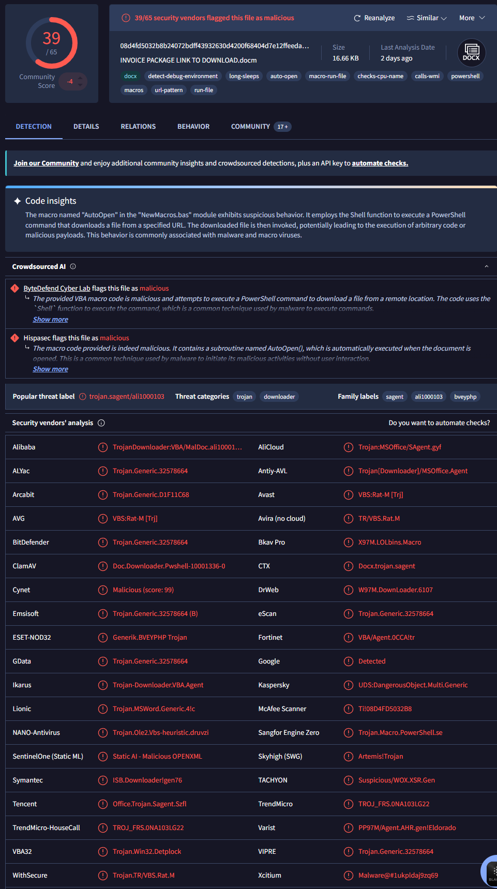
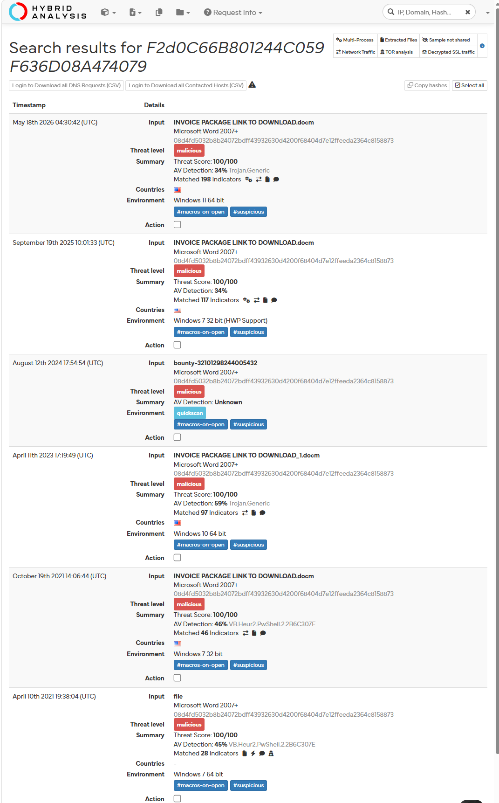

# 🚨 Incident Report: SOC137 - Malicious File/Script Download Attempt (True Positive)

## 🎯 Executive Summary

A severe True Positive security incident involving a targeted delivery of a weaponized document containing malicious execution macros was detected and successfully mitigated. An internal corporate workstation triggered medium-severity alerts during an attempt to download an active malicious binary disguised as an invoice packet (`INVOICE_PACKAGE_DOWNLOAD_LINK.docm`). Threat intelligence cross-referencing confirmed the payload belongs to an aggressive Trojan Downloader campaign engineered to invoke PowerShell strings and download secondary extortion payloads. Because the perimeter defense logged the initial action as Blocked, the threat was neutralized at the delivery phase, requiring no emergency host isolation.

---

## 🔍 Alert Analysis & Triage

* **Event ID:** 76
* **Rule Triggered:** SOC137 - Malicious File/Script Download Attempt
* **Severity:** Medium
* **Target Asset:** Production Workstation (`[REDACTED_HOSTNAME]`)
* **Target IP:** `[REDACTED_INTERNAL_IP]`
* **Trigger Artifact:** `INVOICE_PACKAGE_DOWNLOAD_LINK.docm` (File Size: 16.66 KB)
* **Traffic Direction:** Inbound Delivery / Script Execution Attempt
* **Device Action:** Blocked (Active binary execution prevented on host)

---

## 🖼️ Operational Evidence

Cryptographic extraction and binary metadata triage were conducted to verify file integrity and identify threat actor attribution:

* **MD5 Hash:** `F2d0C66B801244C059F636D08A474079`
* **SHA256 Hash:** `08d4fd5032b8b24072bdff43932630d4200f68404d7e12ffeeda2364c8158873`

Below are the visual threat intelligence indicators mapping the artifact to known phishing and downloader campaigns:

---

## 🕵️‍♂️ Deep-Dive Investigation & Behavior Analysis

### 1. Payload & Family Classification
Analysis of the signature `F2d0C66B801244C059F636D08A474079` yielded a **39 / 65** malicious score on VirusTotal and a **100 / 100** Threat Level on Hybrid Analysis. The payload is universally classified under the **`trojan.downloader/dropper`** family label, frequently associated with macro-based phishing campaigns.

### 2. Host Behavior & Execution Evasion
The `.docm` variant utilizes an embedded `"AutoOpen"` VBA macro structure designed to execute automatically upon document launch without user intervention. Static code insights indicate that the macro invokes native Shell functions to launch a hidden background **PowerShell** process tasked with pulling down secondary execution binaries from external threat actor repositories.

### 3. Network Connection Audit
Log management entries for `[REDACTED_INTERNAL_IP]` were monitored around the alert timestamp (`Mar, 14, 2021, 07:15 PM`). Incident response teams validated that no anomalous outbound traffic or established connections to external Command and Control (C2) infrastructures occurred, proving the execution block was total.

---

## 🛡️ Incident Response & Incident Mitigation

### 1. Host Containment
* **Action:** Active Monitoring Enforced (Network Isolation Omitted).
* **Justification:** Since the device action was **Blocked**, the threat was successfully contained by endpoint protection before achieving system compromise. Host isolation was not triggered, but a localized automated scan was scheduled to ensure no dormant structural persistence.

### 2. Remediation & Hardening Recommendations
* **SOC Team:** Deploy the MD5 and SHA256 signatures to the global corporate Endpoint Detection and Response (EDR) blocklist for enterprise defense-in-depth hardening.
* **Email Security Team:** Update the Secure Email Gateway (SEG) regex rules to flag and drop inbound macro-enabled attachments (`.docm`) originating from external unverified domains.

---

## 📊 Artifacts & Indicators Catalog

The following technical indicators were cataloged during the lifecycle of this incident to harden infrastructure endpoints:

| Artifact Type | Value | Context / Mitigation Role |
| :--- | :--- | :--- |
| **MD5 Hash** | `F2d0C66B801244C059F636D08A474079` | Weaponized VBA macro document core. Added to active blocking rules. |
| **SHA256 Hash** | `08d4fd5032b8b24072bdff43932630d4200f68404d7e12ffeeda2364c8158873` | Primary file signature used for global enterprise infrastructure blacklisting. |

---

## 🎯 Framework Mapping

* **MITRE ATT&CK Framework:**
  * **Tactic:** Initial Access (TA0001)
    * **Technique:** Phishing: Spearphishing Attachment (T1566.001) — *Delivery of a weaponized financial invoice via an attachment link.*
  * **Tactic:** Execution (TA0002)
    * **Technique:** User Execution: Malicious File (T1204.002) — *Reliance on user interaction to open the file and trigger active code.*
    * **Technique:** Command and Scripting Interpreter: PowerShell (T1059.001) — *Leveraging native PowerShell engines to perform stealth downloads.*
* **Vulnerability Classification:** CWE-20: Improper Input Validation (Malicious Execution via External Link Injection)

---

## 📝 Analyst Sign-off Note

The incident has been closed and archived under preventative success logs following verification of delivery mitigation:

* **Final Incident Verdict:** True Positive (Mitigated Delivery)
* **Remediation Action:** Perimeter signatures updated; endpoint structural validation completed.
* **Containment Status:** Secured. Target host `[REDACTED_INTERNAL_IP]` remains fully operational with zero compromise indicators.

> **Analyst Sign-off:** Verification of Event ID 76 confirms a True Positive malicious script download attempt. Due to the proactive enforcement of the endpoint security layers ("Blocked"), the payload failed to execute the PowerShell download string, ensuring zero network share compromise or lateral infrastructure spread. Forensic indicators have been indexed into our centralized repository.
