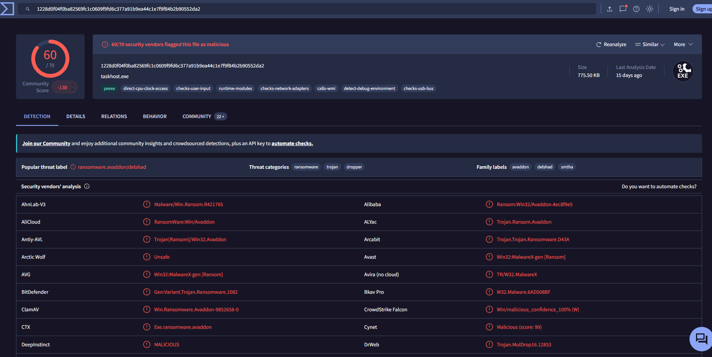
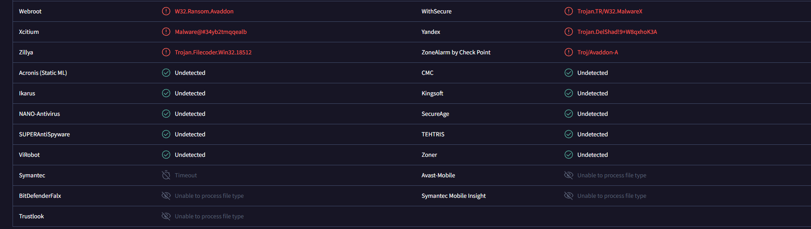
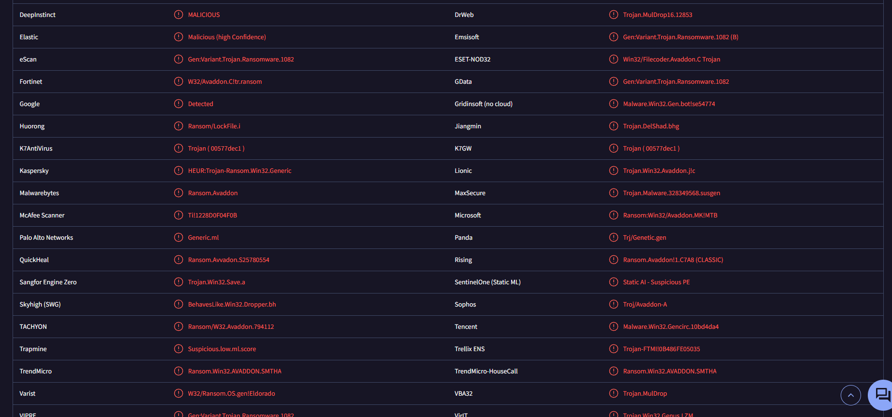

# 🚨 Incident Report: SOC145 - Avaddon Ransomware Infection (True Positive)

## 🎯 Executive Summary

A severe True Positive security incident involving the execution of the Avaddon Ransomware strain was detected and mitigated. An internal corporate workstation triggered high-severity alerts after executing an active malicious binary named `ab.exe` (masquerading internally as `taskhost.exe`). Threat intelligence cross-referencing confirmed the payload belongs to an aggressive Ransomware-as-a-Service (RaaS) family engineered to disable local defensive controls, terminate security services, and encrypt local database sectors. Because the perimeter defense logged the initial action as Allowed, immediate emergency host containment protocols were executed to isolate the asset and prevent lateral infrastructure propagation.

---

## 🔍 Alert Analysis & Triage

* **Event ID:** 92
* **Rule Triggered:** SOC145 - Ransomware Detected
* **Severity:** Critical
* **Target Asset:** Production Workstation (`[REDACTED_HOSTNAME]`)
* **Target IP:** `[REDACTED_INTERNAL_IP]`
* **Trigger Artifact:** `ab.exe` (File Size: 775.50 KB)
* **Traffic Direction:** Internal Execution / Host Compromise
* **Device Action:** Allowed / Permitted (Active binary execution achieved on host)

---

## 🖼️ Operational Evidence

Cryptographic extraction and binary metadata triage were conducted to verify file integrity and identify threat actor attribution:

* **MD5 Hash:** `0b486fe0503524cfe4726a4022fa6a68`
* **SHA256 Hash:** `1228d0f04f0ba82569fc1c0609f9fd6c377a91b9ea44c1e7f9f84b2b90552da2`

Below are the visual threat intelligence indicators mapping the artifact to known extortion campaigns:

---

## 🕵️‍♂️ Deep-Dive Investigation & Behavior Analysis

### 1. Payload & Family Classification
Analysis of the signature `0b486fe0503524cfe4726a4022fa6a68` yielded a **60 / 70** malicious score across global scanning engines. The payload is universally classified under the **`ransomware.avaddon/delshad`** family label. 

### 2. Host Behavior & Antivirus Tampering
Avaddon variants are characterized by immediate tactical evasion behaviors upon execution. The binary attempts to gain administrative privileges to stop local backup services (Volume Shadow Copies deletion), clear system event trails, and systematically terminate antivirus monitoring services to ensure an unhindered encryption process.

### 3. Network Connection Audit
Log management entries for `[REDACTED_INTERNAL_IP]` were monitored around the alert timestamp (`May, 23, 2021, 07:32 PM`). Incident response teams validated the extent of outbound connection attempts to isolate any key-exchange synchronization channels established by the ransomware core back to remote threat actor nodes.

---

## 🛡️ Incident Response & Incident Mitigation

### 1. Host Containment
* **Action:** Immediate Network Isolation / Host Containment Enforced.
* **Justification:** Since the device action was **Allowed**, the host was actively compromised. Network isolation via the Endpoint Security console was triggered immediately to sever all logical links to the local subnet, effectively mitigating the threat of worm-like lateral spread or network share encryption.

### 2. Remediation & Hardening Recommendations
* **SOC Team:** Deploy the SHA256 signature to the global corporate Endpoint Detection and Response (EDR) blocklist to prevent execution on adjacent endpoints.
* **Backup Team:** Initiate immediate health checks on isolated offline backup archives to plan restoration phases for the affected workstation asset.

---

## 📊 Artifacts & Indicators Catalog

The following technical indicators were cataloged during the lifecycle of this incident to harden infrastructure endpoints:

| Artifact Type | Value | Context / Mitigation Role |
| :--- | :--- | :--- |
| **MD5 Hash** | `0b486fe0503524cfe4726a4022fa6a68` | Weaponized Avaddon Ransomware binary core. Added to active blocking rules. |
| **SHA256 Hash** | `1228d0f04f0ba82569fc1c0609f9fd6c377a91b9ea44c1e7f9f84b2b90552da2` | Primary file signature used for global enterprise infrastructure blacklisting. |

---

## 🎯 Framework Mapping

* **MITRE ATT&CK Framework:**
  * **Tactic:** Execution (TA0002)
    * **Technique:** Native API (T1106) — *Direct execution of system calls to manipulate host structures.*
  * **Tactic:** Defense Evasion (TA0005)
    * **Technique:** Impair Defenses: Disable or Modify Tools (T1562.001) — *Disabling antivirus services to ensure persistence.*
    * **Technique:** Indicator Removal: Clear Windows Event Logs (T1070.001) — *Attempting to cover behavioral footprints.*
  * **Tactic:** Impact (TA0040)
    * **Technique:** Data Encrypted for Impact (T1486) — *Systematic encryption of organizational assets for extortion.*
* **Vulnerability Classification:** CWE-799: Improper Control of Interaction between System Components (Ransomware Compromise)

---

## 📝 Analyst Sign-off Note

The incident has been closed and transitioned to the disaster recovery phase following successful host isolation:

* **Final Incident Verdict:** True Positive (Active Compromise)
* **Remediation Action:** Asset isolated; cryptographic blocklists updated enterprise-wide.
* **Containment Status:** Isolated. Host `[REDACTED_INTERNAL_IP]` is disconnected from the operational network environment to stop threat expansion.

> **Analyst Sign-off:** Verification of Event ID 92 confirms a critical True Positive infection involving Avaddon Ransomware on a production host. Due to the permissive nature of the initial download detection ("Allowed"), immediate endpoint containment protocols were carried out to prevent threat proliferation across internal file shares. Forensic artifacts have been processed into defense indicators. The compromised asset remains offline for clean operating system re-imaging and data restoration procedures.
