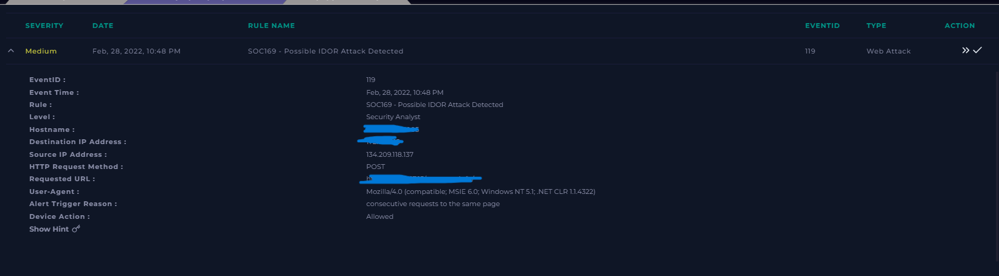
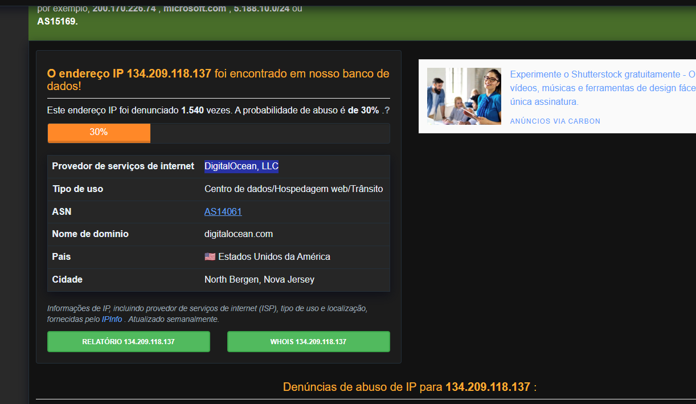
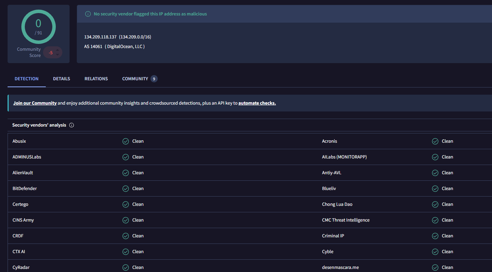
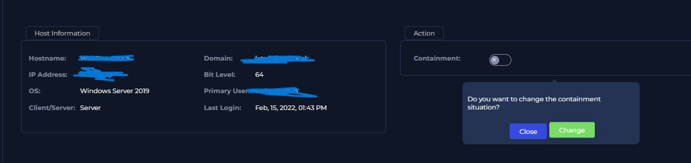

# 🚨 Incident Report: IDOR with Automated Data Exfiltration

## 🎯 Executive Summary
A True Positive IDOR (Insecure Direct Object Reference) attack was detected and analyzed. An external threat actor utilized an automated script to brute-force and fuzz user identifiers via POST requests. This flaw allowed the attacker to bypass authorization controls and successfully exfiltrate sensitive data profiles from multiple user accounts. Immediate mitigation actions were executed, including host containment and indicator logging.

---

## 🔍 Alert Analysis & Triage
* **Event ID:** 119
* **Rule Triggered:** Possible IDOR Attack Detected
* **Severity:** Medium
* **Target Asset:** `WebServer` (Windows Server 2019)
* **Traffic Direction:** External-to-Internal (Internet ➡️ Private Network)
* **Threat Actor IP:** `134[.]209[.]118[.]137` (DigitalOcean LLC)
* **Target Endpoint:** `https://[REDACTED_INTERNAL_IP]/get_user_info/`
* **Device Action:** Allowed / Permitted (Bypassed perimeter defense)

### 🖼️ Operational Evidence
Below is the initial alert triage showing the traffic directionality and the targeted parameters:

---

## 🕵️‍♂️ Deep-Dive Investigation

### 1. Threat Intelligence & Reputation Check
The source IP `134[.]209[.]118[.]137` was cross-referenced across multiple global threat databases to ascertain intent:
* **AbuseIPDB:** Identified as highly malicious with **over 1,540 abuse reports** detailing continuous scanning and web exploitation attempts.
* **VirusTotal & Cisco Talos:** Returned clean/neutral verdicts. This mismatch is a classic indicator of cloud infrastructure abuse, where threat actors spin up short-lived virtual servers (VPS) within trusted providers (DigitalOcean) to conduct malicious actions before the IP gets globally blacklisted.

### 2. Web Log & Payload Analysis (Exploit Verification)
An inspection of the raw HTTP server logs on `WebServer1005` provided definitive proof of a successful breach. The attacker executed sequential POST requests targeting the user information endpoint. 

The core evidence lies in the **HTTP Response Size variance**:
* `POST /get_user_info/ ?user_id=1` ➡️ Status: `200` | Size: **188 bytes**
* `POST /get_user_info/ ?user_id=2` ➡️ Status: `200` | Size: **253 bytes**
* `POST /get_user_info/ ?user_id=3` ➡️ Status: `200` | Size: **351 bytes**
* `POST /get_user_info/ ?user_id=4` ➡️ Status: `200` | Size: **158 bytes**
* `POST /get_user_info/ ?user_id=5` ➡️ Status: `200` | Size: **267 bytes**

**Analytical Conclusion:** If the attack had failed or been blocked, the web application would have responded with static error lengths (e.g., a 403 Forbidden or 404 page with identical byte sizes). Because the response sizes fluctuated significantly for every unique ID requested, it is confirmed that the application processed the commands and leaked individual database data back to the attacker.

---

## 🛡️ Incident Response & Mitigation

### 1. Host Containment
Due to active data exfiltration and the potential risk of lateral movement or persistence deployment, network-level isolation was immediately performed on the asset.

* **Action:** Triggered **Host Containment** via Endpoint Security Management.
* **Result:** The compromised web server was isolated from the production environment, allowing only isolated forensics access.

### 2. Remediation Recommendations
* **AppSec Team:** Patch the `/get_user_info/` endpoint to implement strict Object-Level Access Control. Ensure the system verifies if the currently authenticated session owns the requested `user_id` before returning database records.
* **Network Team:** Deploy a Web Application Firewall (WAF) rule to block rate-limited consecutive parameter changes on administrative endpoints.
* **Threat Intel:** Deploy IP `134[.]209[.]118[.]137` to the global perimeter blocklist.

---

## 🎯 Framework Mapping
* **MITRE ATT&CK:** Tactic: Initial Access (TA0001) / Exfiltration (TA0010)
  * Technique: Exploit Public-Facing Application (T1190)
* **Vulnerability Classification:** CWE-639: Authorization Bypass Through User-Controlled Key (IDOR)
